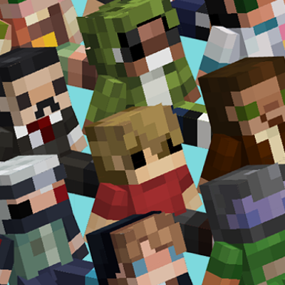

<h1 align="center">
    
    <br/>
    Dogcraft Pack
</h1>

Resource pack files for Dogcraft.net.


### Custom Model Data table 

#### Gold Nugget
| ID | Model name |
|:--:|------------|
| 1  | Rencoin    |

```
/give @s minecraft:gold_nugget{CustomModelData:1, display:{Name:'{"text":"Rencoin","color":"yellow","italic":"false"}'}} 1
```
New 1.21.4 command:
```
/give @s minecraft:gold_nugget[minecraft:custom_model_data='{floats:[1.0]}',minecraft:custom_name='{"text":"Rencoin","color":"yellow","italic":"false"}'] 1
```

#### Carved Pumpkin
| ID | Model name           |
|:--:|----------------------|
| 1  | BDubs Moss           |
| 2  | BDubs Steampunk      |
| 3  | BDubs                |
| 4  | Cubfan               |
| 5  | Doc                  |
| 6  | Etho                 |
| 7  | Falsesymmetry        |
| 8  | Geminitay            |
| 9  | Grian                |
| 10 | Grumbot              |
| 11 | Scar                 |
| 12 | Scar Steampunk       |
| 13 | Scar Elf             |
| 14 | Scar Imagineer       |
| 15 | Scar hOtgUy          |
| 16 | Hypno                |
| 17 | Jevin                |
| 18 | Impulse              |
| 19 | Impulse Dwarf        |
| 20 | Iskall               |
| 21 | Jellie               |
| 22 | JoeHills             |
| 23 | Jhost                |
| 24 | Keralis              |
| 25 | Keralis Steampunk    |
| 26 | Mumbo                |
| 27 | Pearl                |
| 28 | Pearl Cleaning Lady  |
| 29 | Renthedog            |
| 30 | Rentheking           |
| 31 | Stress               |
| 32 | Stress GG            |
| 33 | Tango                |
| 34 | Tango Steampunk      |
| 35 | Tango Dungeon Master |
| 36 | TFC                  |
| 37 | VintageBeef          |
| 38 | VintageBeef S9       |
| 39 | Welsknight           |
| 40 | Helsknight           |
| 41 | XBcrafted            |
| 42 | Xisuma               |
| 43 | Xisuma Bonemage      |
| 44 | Evil Xisuma          |
| 45 | Zedaph               |
| 46 | Zedaph Daredevil     |
| 47 | Zedaph Steampunk     |
| 48 | ZombieCleo           |
| 49 | ZombieCleo Gorgon    |
| 50 | Pixlriffs            |
| 51 | ZloyXP               |
| 52 | Lyarrah              |
| 53 | Ariana Griande       |
| 54 | Straw hat            |
| 55 | Ender Dragon         |
| 56 | Snowman2024          |
| 57 | ironplushie          |
| 58 | renspaceexplorer     |
| 59 | mumbostash           |
| 60 | dclogo               |
| 61 | Gravestone rounded   |
| 62 | Gravestone cross     |
| 63 | Gravestone slab      |
| 64 | Dogcraft logo badge  |
| 65 | Raven                |
| 66 | Skull and bones      |
| 67 | Grave candle         |
| 68 | Dead bush            |
| 69 | Coffin               |
| 70 | End trophy           |
| 71 | Jack o lantern       |
| 72 | Golden trophy        |
| 73 | Silver trophy        |
| 74 | Bronze trophy        |

The gravestones are built for **item frames laid flat on the ground** - they
stand upright out of the frame at full size. Right-click the frame to turn the
stone to one of 8 facings, and use an invisible frame so only the stone shows:
```
/give @s minecraft:item_frame[minecraft:entity_data={id:"minecraft:item_frame",Invisible:1b}] 1
```
```
/give @s minecraft:carved_pumpkin[minecraft:custom_model_data={floats:[61.0]},minecraft:custom_name='{"text":"Gravestone","color":"gray","italic":false}'] 1
```

#### Golden Apple
| ID | Model name           |
|:--:|----------------------|
| 1  | Box of chocolate     |
| 2  | Candy cane           |
| 3  | Slushie              |

#### Golden Nugget
| ID | Model name           |
|:--:|----------------------|
| 1  | RenCoin              |

#### Baseball caps

These use the item-model route rather than Custom Model Data. Setting
`equippable` with **no `asset_id`** makes Minecraft fall back to the item's
own 3D model on the head, so the whole cap renders and the helmet keeps its
armour, durability and enchantments.

| Model name             | item_model id               |
|------------------------|-----------------------------|
| Dogcraft cap           | minecraft:dogcraftcap       |
| Dogcraft cap backwards | minecraft:dogcraftcapback   |

```
/give @s minecraft:leather_helmet[minecraft:item_model="minecraft:dogcraftcap",minecraft:equippable={slot:"head",equip_sound:"item.armor.equip_leather"}] 1
```

#### Large logo display

`minecraft:dclogobadgebig` is the 128x128 version of the logo, built at the
largest size Minecraft allows in an item frame. Model elements are capped at
-16..32 (3 blocks) and `display.scale` is capped at 4, and an item frame then
halves it, so it renders **6 x 6 blocks**. Put it in a wall frame (use an
invisible one) and it hangs upright, centred on the frame.

```
/give @s minecraft:paper[minecraft:item_model="minecraft:dclogobadgebig"] 1
```

To go past 6 blocks it has to be an item display entity rather than a frame,
since those are not bound by the frame's halving - raise `scale` as needed:

```
/summon minecraft:item_display ~ ~1 ~ {item:{id:"minecraft:paper",count:1,components:{"minecraft:item_model":"minecraft:dclogobadgebig"}},transformation:{left_rotation:[0f,0f,0f,1f],right_rotation:[0f,0f,0f,1f],translation:[0f,0f,0f],scale:[4f,4f,4f]},billboard:"fixed"}
```